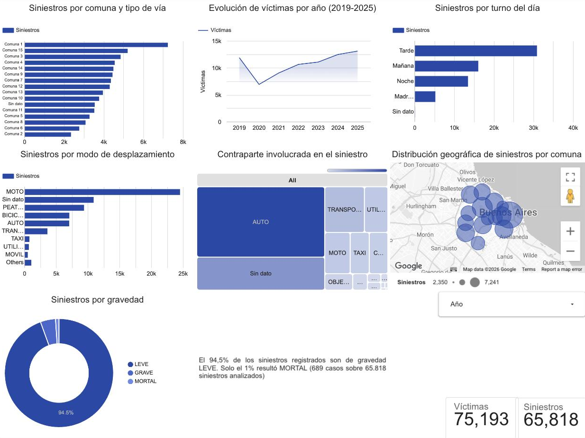
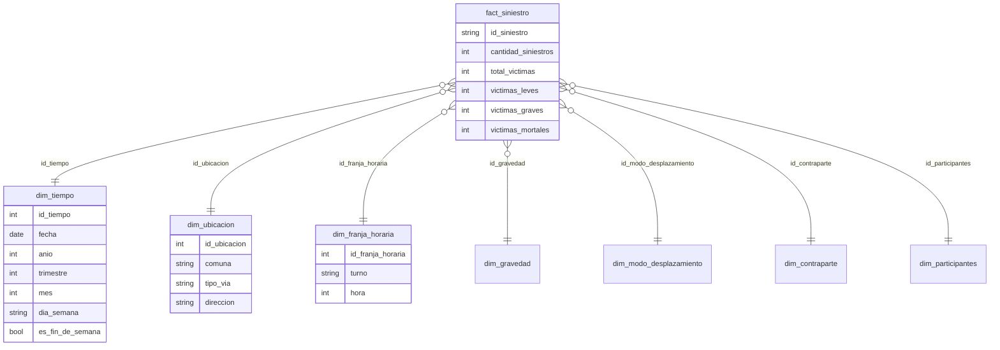

# Data Warehouse de siniestros viales en CABA

Proyecto de Business Intelligence: un data warehouse para analizar los siniestros viales registrados en la Ciudad de Buenos Aires entre 2019 y 2025, explotado con una herramienta OLAP (Google Looker Studio).

> Trabajo en equipo de 4 personas para la materia de Business Intelligence. Mi parte, que es lo que está en este repositorio: el proceso ETL en Python, el modelo dimensional y el dashboard.



## Preguntas de negocio

- ¿En qué comunas, franjas horarias y días de la semana se concentran los siniestros?
- ¿Qué combinaciones de víctima y contraparte producen más víctimas graves o mortales?
- ¿Cómo evolucionó la siniestralidad año a año?

## Datos

- **Fuente:** dataset de siniestros viales (hechos) del portal de datos abiertos de la Ciudad, [BA Data](https://data.buenosaires.gob.ar/).
- **Volumen:** 65.818 siniestros.
- El CSV original **no está incluido** en el repo. Hay que descargarlo del portal.

## Modelo dimensional

Esquema estrella. **Grano:** un registro por siniestro.



| Dimensión | Tipo | Jerarquía |
|---|---|---|
| `dim_tiempo` | Jerárquica | año → trimestre → mes → día |
| `dim_ubicacion` | Jerárquica | comuna → tipo de vía → dirección |
| `dim_franja_horaria` | Jerárquica | turno → hora |
| `dim_gravedad`, `dim_modo_desplazamiento`, `dim_contraparte`, `dim_participantes` | Planas | — |

Aparte, `dim_comuna_geo` guarda el centroide aproximado de cada comuna (el promedio de las coordenadas de sus siniestros), que se usa para los mapas.

## Decisiones de limpieza

| Problema en los datos | Decisión |
|---|---|
| Comunas con formatos mezclados (`"Comuna 8"`, `"8"`, vacío) | Se normalizan a `Comuna N`. Todo lo que queda fuera de 1–15 pasa a `SIN DATO`. |
| Nulos representados de varias maneras (`SD`, `#¡REF!`, vacío, NaN) | Se unifican en `SIN DATO`, también dentro de los pares de participantes (`MOTO-SD` → `MOTO-SIN DATO`). |
| `dia_siniestro` que no coincide con `fecha_siniestro` (1 caso) | La **fecha** es la fuente de verdad. Año, trimestre, mes y día se derivan de ella. |
| `total_victimas` informado como `SD` (3.276 casos) o distinto de leves + graves + mortales (2 casos) | El total se **recalcula** como la suma, porque el desglose por gravedad es el dato más granular y está completo. |
| Hora vacía o fuera de rango (se usa `rango_horario`, la hora entera) | Se usa `hora = -1` con turno `SIN DATO`, para no perder el siniestro. |

Cada ejecución imprime un reporte con la cantidad de filas afectadas por cada regla.

**Limitación conocida:** la jerarquía de ubicación sirve para navegar pero no es estricta, porque una misma avenida cruza varias comunas.

## Cómo correrlo

```bash
pip install pandas
python3 limpieza_siniestros.py siniestros_viales_hechos.csv salida/
```

Genera en `salida/` la tabla de hechos y las dimensiones como CSV, listas para importar en Looker Studio, Power BI o una base relacional.

## Stack

Python (pandas) · Google Looker Studio
